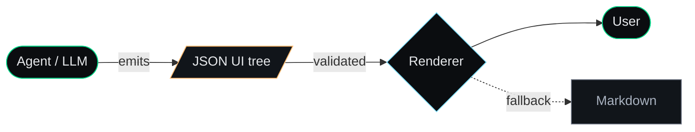
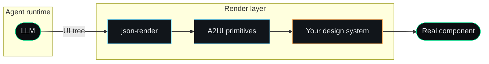
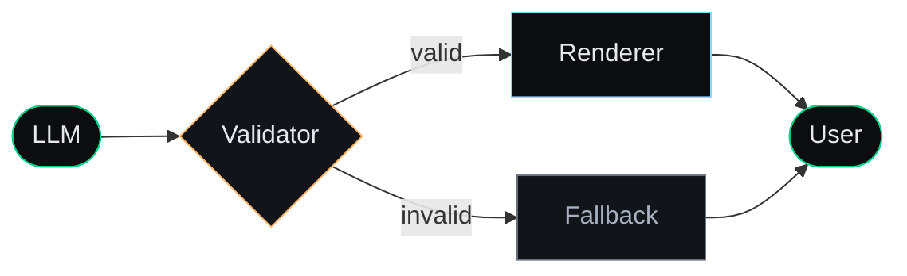

<div class="fixed top-6 right-6 z-10">
  
</div>

<div class="w-72 mx-auto mb-6 opacity-95">
  <TextToTreeMorph />
</div>

# Protocol Over Prose

<div class="text-xl mt-3 dim">
  Engineering Rich Interactivity with <span class="accent">A2UI</span>
</div>

<div class="fixed bottom-10 left-0 right-0 text-center text-xs dim font-mono tracking-wider">
  Maina Wycliffe · @mainawycliffe &nbsp;·&nbsp; Lightning talk · 15 min
</div>

<!--
Intro: who you are, why you care about this topic.
Open: "What if your agent stopped writing essays and started shipping interfaces?"
-->

---
layout: default
---

<div class="chip">01 · The hook</div>

# We're hitting the limits of prose.

<div class="grid grid-cols-2 gap-12 mt-8">

<div>

<div class="chat-bubble">
Sure! Here is a table of users:

```
| Name  | Role     | Last seen |
|-------|----------|-----------|
| Ada   | Engineer | 2h ago    |
| Linus | PM       | 1d ago    |
```

</div>

</div>

<div class="self-center">

- You can't sort it.
- You can't filter it.
- You can't click a row.
- You can't even copy it cleanly.

<div class="mt-6 amber">
The agent isn't dumb. The <em>medium</em> is.
</div>

</div>

</div>

<!--
Most LLM products today render markdown. Markdown is a 20-year-old
document format. We are shoving rich, stateful, interactive concepts
through a document pipe.
-->

---
layout: default
---

<div class="chip">02 · The problem</div>

# Things markdown <span class="amber">cannot</span> do

<div class="grid-cells">
  <div v-click>Interactivity</div>
  <div v-click>Validation</div>
  <div v-click>State</div>
  <div v-click>Animation</div>
  <div v-click>Brand / design system</div>
  <div v-click>Accessibility hooks</div>
</div>

<div v-click class="mt-8 dim">
And yet we keep asking models to <span class="accent">describe</span> these things
instead of <span class="accent">declare</span> them.
</div>

<!--
Pause on each bullet. Land the punchline: describe vs declare.
-->

---
layout: center
---

<div class="chip">03 · The shift</div>

# What is <span class="accent">A2UI</span>?

<div class="mt-6 text-xl dim">
Agent-to-UI: a <span class="accent">protocol</span> for what your agent <em>renders</em>,
not what it <em>says</em>.
</div>

<div class="mt-12">



</div>

<!--
The agent emits a contract, not prose. A renderer turns the contract
into a real component tree. Markdown becomes the fallback, not the default.
-->

---
layout: default
---

<div class="chip">04 · The shape of the contract</div>

# A contract is just <span class="accent">JSON Schema</span>.

````md magic-move {lines: true}
```json
{
  "type": "text",
  "content": "Sure! Here is a table of users…"
}
```

```json
{
  "type": "table",
  "columns": ["Name", "Role", "Last seen"],
  "rows": [
    ["Ada", "Engineer", "2h ago"],
    ["Linus", "PM", "1d ago"]
  ]
}
```

```json
{
  "type": "table",
  "columns": [
    { "key": "name", "label": "Name", "sortable": true },
    { "key": "role", "label": "Role", "filter": "select" },
    { "key": "seen", "label": "Last seen", "format": "relative-time" }
  ],
  "rows": [
    { "name": "Ada", "role": "Engineer", "seen": "2025-05-15T12:00Z" },
    { "name": "Linus", "role": "PM", "seen": "2025-05-14T14:00Z" }
  ],
  "actions": [{ "id": "invite", "label": "Invite", "row": true }]
}
```
````

<div class="mt-4 dim text-base">
Prose → table → <span class="accent">interactive table</span>. Same surface, more capability.
</div>

<!--
Magic Move animates the JSON growing in expressiveness.
The point: the contract scales from trivial to rich without
changing the channel.
-->

---
layout: default
---

<div class="chip">05 · Enforcing the contract</div>

# Validate with <span class="accent">Zod</span>.

````md magic-move {lines: true}
```ts
import { z } from 'zod'

const UINode = z.object({
  type: z.literal('text'),
  content: z.string(),
})
```

```ts
import { z } from 'zod'

const UINode = z.discriminatedUnion('type', [
  z.object({
    type: z.literal('text'),
    content: z.string(),
  }),
  z.object({
    type: z.literal('table'),
    columns: z.array(z.string()),
    rows: z.array(z.array(z.string())),
  }),
])
```

```ts
import { z } from 'zod'

const Column = z.object({
  key: z.string().describe('The row property to read. Must exist on every row.'),
  label: z.string().describe('Human-readable header text shown above the column.'),
  sortable: z.boolean().optional()
    .describe('Set true when the user should be able to sort by this column.'),
  filter: z.enum(['text', 'select']).optional()
    .describe('Use "select" for low-cardinality fields, "text" for free-text.'),
})

const UINode = z.discriminatedUnion('type', [
  z.object({
    type: z.literal('text'),
    content: z.string(),
  }).describe('Use when a plain prose answer is enough. Renders as markdown.'),

  z.object({
    type: z.literal('table'),
    columns: z.array(Column),
    rows: z.array(z.record(z.string(), z.any())),
    actions: z.array(
      z.object({ id: z.string(), label: z.string() })
    ).optional()
      .describe('Optional row actions. Emit only if the user can act on a row.'),
  }).describe('Use when the data has repeating structure the user may want to sort, filter, or act on.'),
]).describe('Every UI element you are allowed to emit. Pick exactly one per response.')
```

```ts
// at the render boundary
const result = UINode.safeParse(agentPayload)

if (!result.success) {
  return renderFallback(result.error)   // markdown / "I don't know"
}

return renderUI(result.data)            // typed, trusted, branded
```
````

<div class="mt-4 dim text-base">
Validate the output, ensure the model is following the contract. Fail gracefully or retry when it doesn't.
</div>

<!--
This is the missing piece from the previous slide.
JSON Schema is the spec; Zod is how we actually enforce it
at the render boundary. safeParse is the gate — if it fails,
we degrade gracefully. This is the validator from the
"Don't blindly render" slide, in code.
-->

---
layout: default
---

<div class="chip">06 · Wiring the agent</div>

# Generate with <span class="accent">Genkit</span>.

```ts {all|3|10|13|17|all}
import { genkit } from 'genkit'
import { googleAI } from '@genkit-ai/google-genai'
import { UINode } from './ui-schema'   // ← the Zod schema from the previous slide

const ai = genkit({
  plugins: [googleAI()],
  model: googleAI.model('gemini-2.5-flash'),
})

const { output } = await ai.generate({
  prompt: 'Show me my last 10 sign-ups.',
  output: { schema: UINode },
})

// `output` is typed as UINode and already validated.
// Hand it straight to the renderer — no extra parsing.
return renderUI(output)
```

<div class="mt-4 dim text-base">
Genkit ships the schema — <span class="accent">descriptions and all</span> — to the model, then parses the response. One schema, two jobs.
</div>

<!--
The describe() strings from the previous slide become the LLM's
instructions when Genkit serializes the Zod schema for the model.
Genkit handles the round trip: serialize → call → parse → retry
on failure. Your code only ever sees a validated UINode.
-->

---
layout: default
---

<div class="chip">07 · The render layer</div>

# How does the JSON become a UI?



<div class="mt-6 dim text-base">
The agent never touches your design system. The renderer does.
That's the whole game.
</div>

<!--
Key insight: separation of concerns. The LLM does intent;
the renderer does brand, a11y, i18n, dark mode, etc.
-->

---
layout: two-cols
layoutClass: "gap-12"
---

<div class="chip">08 · Live shape</div>

# JSON in. UI out.

```json
{
  "type": "card",
  "title": "Sign up for the beta",
  "subtitle": "Get early access…",
  "fields": [
    { "type": "text", "name": "name" },
    { "type": "email", "name": "email" },
    { "type": "select", "name": "role", "options": ["Engineer", "Designer", "PM", "Other"] },
    { "type": "checkbox", "name": "updates" }
  ],
  "submit": {
    "label": "Request access",
    "variant": "primary"
  }
}
```

::right::

<div class="flex items-center justify-center h-full">
  <JsonRenderDemo />
</div>

<!--
This is rendered LIVE from the JSON on the left. No screenshot.
The agent could have emitted this. The renderer did the rest.
-->

---
layout: center
---

<div class="chip">09 · In the wild</div>

<div class="text-2xl mb-5 text-center">
  Same contract. <span class="accent">Real framework.</span>
</div>

<div class="flex justify-center">
  <video
    src="/a2ui-angular.mp4"
    autoplay
    muted
    loop
    playsinline
    class="rounded-lg border border-[#25292f] max-w-2xl w-full shadow-2xl"
  ></video>
</div>

<div class="mt-4 dim text-sm text-center">
  Same JSON shape from the previous slide — rendered into a real Angular component tree.
</div>

<!--
This is the punchline of the "live shape" beat: the contract isn't
tied to one framework or one renderer. The agent emits the same JSON;
Angular renders it natively.
-->

---
layout: default
---

<div class="chip">10 · Why this matters</div>

# What you actually win

<div class="grid grid-cols-2 gap-x-12 gap-y-6 mt-8 text-lg">

<div v-click>
<div class="accent font-bold mb-1">→ Composable UIs</div>
<div class="dim">Agents become components, not chat logs.</div>
</div>

<div v-click>
<div class="accent font-bold mb-1">→ Designers stay in control</div>
<div class="dim">Brand lives in the renderer, not the prompt.</div>
</div>

<div v-click>
<div class="accent font-bold mb-1">→ A11y & i18n for free</div>
<div class="dim">Your design system already solves this.</div>
</div>

<div v-click>
<div class="accent font-bold mb-1">→ Testable surface</div>
<div class="dim">JSON is greppable. Prose isn't.</div>
</div>

</div>

<!--
Reframe: this isn't about prettier chat. It's about agents
becoming a first-class part of the product surface.
-->

---
layout: default
---

<div class="chip">11 · Watch-outs</div>

# Don't <span class="amber">blindly</span> render.



<div class="grid grid-cols-3 gap-3 mt-6 text-base">
  <div><span class="amber font-bold">Schema drift</span> — pin versions.</div>
  <div><span class="amber font-bold">Security</span> — no arbitrary HTML, sanitise URLs.</div>
  <div><span class="amber font-bold">Perf</span> — large trees? virtualise.</div>
</div>

<!--
Validation is the most important piece of a production setup.
A renderer that fails open is a security incident waiting to happen.
-->

---
layout: center
class: text-center
---

<div class="chip">12 · Takeaway</div>

<div class="fixed top-6 right-6 flex flex-col items-center gap-1 z-10">
  
  <div class="text-[10px] dim font-mono tracking-wider">scan for slides</div>
</div>

# Stop writing prose.

# Start shipping <span class="accent">contracts.</span>

<div class="mt-12 text-lg dim">
Markdown was the bridge. <span class="accent">Protocol</span> is the road.
</div>

<div class="mt-16 text-sm dim font-mono">
  Maina Wycliffe · @mainawycliffe
</div>

<!--
Land the line. Pause. Take questions.
-->
